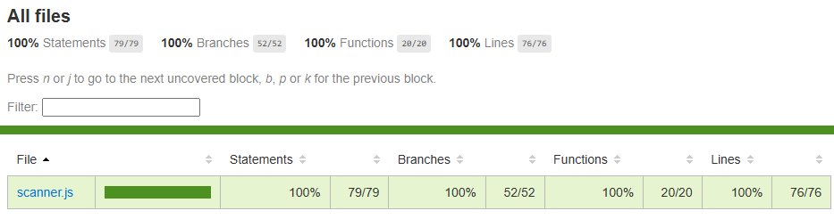

# Test Report

<!--
    Commit this file to the root of your GitHub repository, alongside your module's code.
    It is required regardless of how you tested your module — even if your tests live in a
    test application or use a testing framework, summarize them here.
-->

## Summary

*Briefly describe how you tested your module, and why you chose that approach — clearly enough
that someone else could carry out the same tests. What was hardest to test, and why?*

*If you used a testing framework, you may link to its generated report or include screenshots of
the test run here.*

Answer:

#### Method 1

The Scanner module was tested using multiple methods during its development. Through out its creating the [test.js](./test.js) file was the main source of testing and was updated retroactively as new methods and interactions was created. The current stage of [test.js](./test.js) serves as a small test or example application that uses some of the main features in the module.

#### Method 2

After the main methods and functionality of the module was realized [a new test file](./tests/scanner.test.js) was created. These test use vitest to implement unit test that better serve to test the application from an automated and thorough tests. These test aim to have a 100% overage over the scanner code to better ensure unwanted behaviors are found and fixed. To use the automated tests make sure to install the required dependencies to use vitest and then run `npm test` in a console.

#### Reasoning

The main reasoning for using multiple testing methods while developing the module comes down to the strength of the methods.
While the unit tests provide a cohesive, covering, and deterministic test it also takes more effort to implement. While the module is being developed and its full implementation is not fully realized it is much simpler to use a smaller test file that only test what is currently being worked on. The downside of this testing approach it that new implementations could break older code that is no longer tested for.

## Test Results
<!--
**Example** (shows what a filled-in row can look like — remove this example table before
submitting):

| What was tested                                                        | How it was tested                                                                                                       | Result                                                                       |
| ------------------------------------------------------------------------ | --------------------------------------------------------------------------------------------------------------------- | ------------------------------------------------------------------------------ |
| `Jpeg.load(path)` returns a `Picture` instance for a valid image file. | Automated unit test (Vitest): loaded `test-image.jpg` and checked that the return value had `getHeight()`/`getWidth()` methods. | ✅ Passed.                                                                    |
| `Picture.getPixelAt(x, y)` with coordinates outside the image.         | Manual test via the Test-App's interface: entered a coordinate pair larger than the image's width/height and observed the output. | ❌ Didn't throw an error initially — fixed, now throws a clear exception. |

**Your test results:**
-->
| What was tested | How it was tested | Result |
| ---------------- | ------------------ | ------- |
| `Scanner.nextLine()` reads full lines and reports EOF when no line remains | Automated test (Vitest): Checks that two lines are read and an `EndOfFileError` is thrown on EOF. | ✅ Passed. |
| `Scanner.nextTokens()` reads returns all tokens and escapes/skips whitespace/empty lines + returns leftover tokens and reports EOF | Automated test (Vitest): Checks that set input returns correct tokens and captures `EndOfFileError`. | ✅ Passed. |
| `Scanner.next()` reads and returns the next token and reports EOF. | Automated test (Vitest): loads tokens and captures `EndOfFileError` when expected.  | ✅ Passed. |
| `Scanner.pauseUntilNext()` waits for the next line and resolves when the input closes | Automated test (Vitest): tested be awaiting method to resolve to undefined. (better tested in manual test.js) | ✅ Passed. |
| `Scanner.hasNext()` reports if there are any tokens in the current buffer. | Automated test (Vitest): loads tokens into the scanner and runs `.next()` and checks for no more tokens when expected. | ✅ Passed. |
| `Scanner.clearInput()` clears the current buffer and the line-reader queue. | Automated test (Vitest): loads an input and checks that it is there, clears it and checks `.hasNext()` to be `false`. | ✅ Passed. |
| `Scanner.nextNumber()` reads the next token and validates it as a number, throws a `TypeError` if token is not a number, and can match/validate a min and max value which in turn throws a `RangeError`. | Automated test (Vitest): loads multiple number like tokens and reads them, checks respective number for correct action: parsed number or `TypeError`. Checks new numbers with a set range. | ✅ Passed. |
| `Scanner.nextString()` reads the next string and can match it against a pattern (throws `RegExpDoesNotMatchError`) and check the range (throws `RangeError`). | Automated test (Vitest): loads multiple tokens and runs them against patterns, lengths, and catches expected errors. | ✅ Passed. |
| `Scanner.prompt()` writes a prompt to the output and return an reference to itself | Automated test (Vitest): Creates a prompt and checks that the return value is the same scanner and that the output was called with the prompt text. | ✅ Passed. |
| `Scanner.saveBuffer()` saves the current buffer to a new name and `Scanner.useBuffer()` can switch to that buffer. | Automated test (Vitest): loads tokens and saves them to a new buffer, switches to it and validates the read. | ✅ Passed. |
| `Scanner.pushBuffer()` creates a snapshot of the current buffer and and that `Scanner.popBuffer()` can restore it or throw an `Error` of there are not buffers to left to restore. | Automated test (Vitest): loads tokens, pushes, reads, and pops it back. Then pops it again and expects an error. | ✅ Passed. |
| `Scanner.removeBuffer()` removes the buffer and if it is in uses defaults to the default buffer and throws if an attempt to remove the default buffer is performed. | Automated test (Vitest): loads tokens, creates a new buffer and then removes it, expects the default buffer to be in use. Then tries to remove the default buffer and expects an error. | ✅ Passed. |